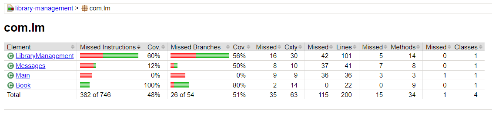
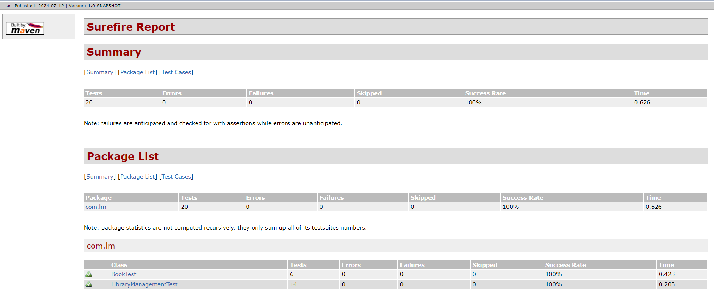

## library-management: A command line application in JAVA
A simple command line JAVA program for Library Management.

#### A brief overview:
This program is menu-driven. User will be presented with available options corresponding to selected menu.
User will select an option from given choices and press ENTER key to move to next step.
This program will save all book details and their transactions in the data file, therefore, next time when you open the program, it will resume its state.

#### Basic features
* Models a book with:
    * book title
    * book author
    * availability status
  

* Support the ability to
    * add and categorize expenses
    * list expense
    
* Support a text-based user interface
* Load and save book list to data file

### Jacoco - Unit test coverage tool

### Maven Surefire Unit Test Report for the execution below:
