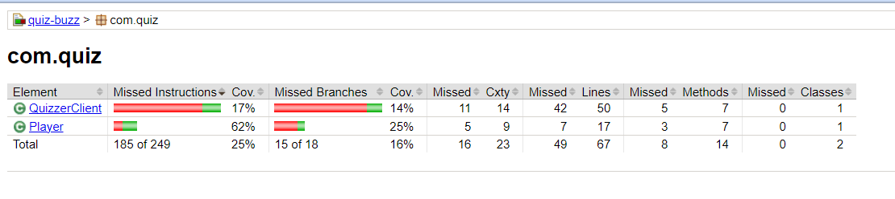
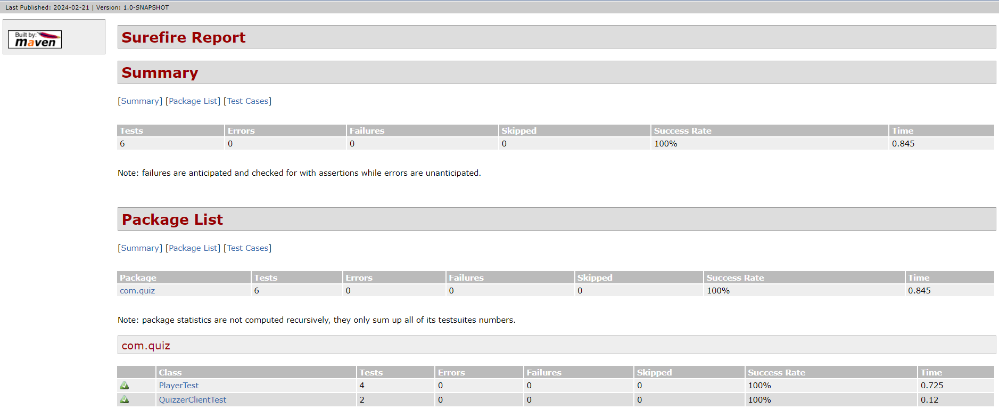

## A Console Game Development

### Chalk library used as decorator

### Game ideas
> App supports multiple players
> 
> Every player have 2 attempts to guess number correctly
> 
> Points calculated for right guess and winner announced at the end of game !!!

### Jacoco - Unit test coverage tool

### Maven Surefire Unit Test Report for the execution below:

